<div align="center">

# Prism

**A YouTube Music client for Android, with word-by-word lyrics, Replay, offline downloads and full Android Auto support.**

[](../../releases/latest)


[](https://ko-fi.com/yigder)

**[⬇ Download Prism.apk](../../releases/latest/download/Prism.apk)** · [Release notes](../../releases/latest)

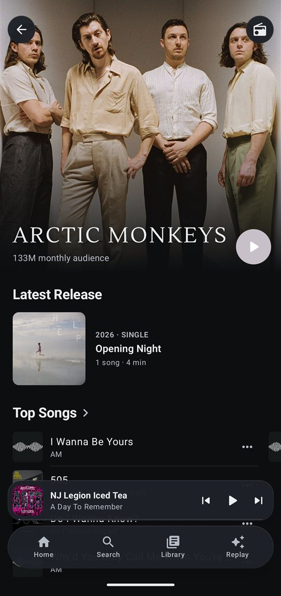
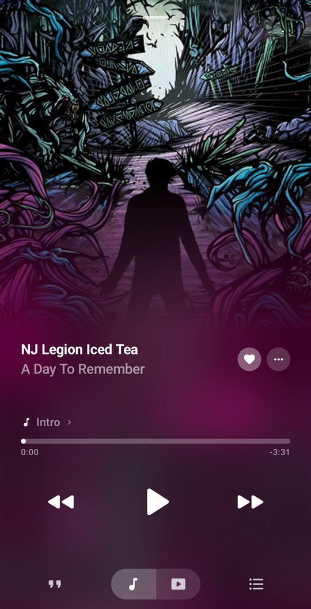
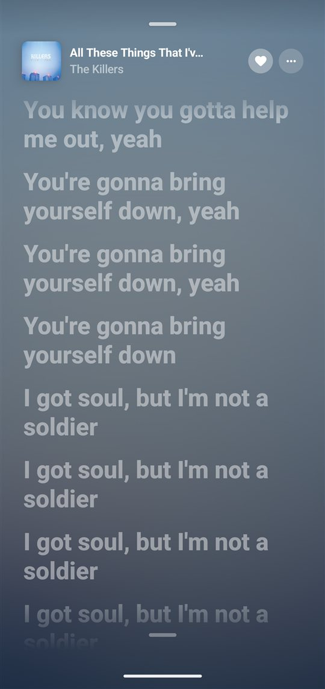
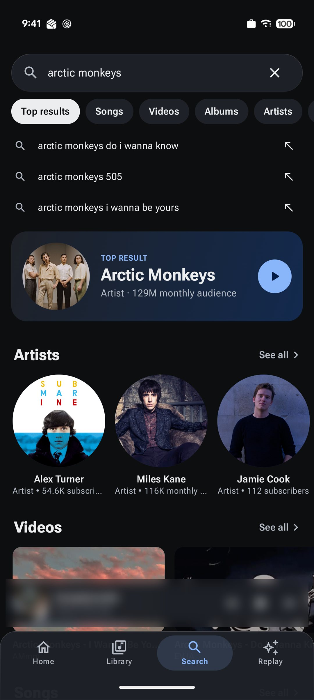

</div>

> [!NOTE]
> Prism is an independent, unofficial app. It is not affiliated with, endorsed by, or connected to Google, YouTube or YouTube Music.

## Install

1. Download **`Prism.apk`** from the [latest release](../../releases/latest) on your phone.
2. Open it. Android will ask you to allow installs from your browser or file manager.
3. Optional: sign in with your YouTube Music account to sync likes, playlists, albums and artists.

Updating works the same way: install the new APK over the old one, and your downloads, Replay history and settings stay.

## Highlights

| | |
|---|---|
| 🎤 **Word-by-word lyrics** | Ten lyric sources, karaoke timing first, then line-synced, then plain. Switch source per song and nudge the timing. |
| 🎨 **Make it yours** | Font, text size, corners, spacing, nav bar, mini player, player background and controls, lyrics alignment, Replay colours and eleven screen backgrounds. |
| 📊 **Replay** | A private, on-device recap of your listening, with a full-screen story. |
| 🎬 **Music videos** | Switch any song to its music video in one tap, with lyrics in sync and full-screen landscape. |
| 🎧 **Listen together** | Phones on the same Wi-Fi play in step, or friends add songs to your queue. No account, no server. |
| 🔗 **Share anything** | Story cards and links for songs, albums, playlists and artists, plus "Play in Prism" for YouTube links. |
| 📥 **Offline** | Downloads and smart downloads, with lyrics saved alongside every song. |
| 🎚️ **Sound** | 10-band EQ, loudness normalization, Prism Spatial, skip silence and lossless playback. |
| 🚗 **Android Auto** | Shuffle play, extra player buttons and lyrics on the car screen. |

## Features

### Listening
- **Lyrics, word by word.** Better Lyrics (Apple Music's timed lyrics), QQ Music, NetEase, KuGou, LyricsPlus, Bini, LRCLIB, Unison, Genius and YouTube Music. Starred-out swear words ("f**k") are filled back in from Genius's full text, keeping the word-by-word timing.
- **Player.** Full-bleed artwork and animated covers. Shows the codec and bitrate (or Lossless / Downloaded), with stats in an in-player panel.
- **Music videos.** Tap the video toggle under the player to switch any song to its official music video. Playback carries on from the same spot, and the lyrics stay in sync. Fit or fill the frame, go full screen, or turn the phone sideways for edge-to-edge landscape. Video quality goes from 480p up to 1440p in Playback & sound.
- **Sound.** 10-band equalizer with presets, bass boost, loudness normalization (uses YouTube's own loudness data, works offline), Prism Spatial for any headphones, skip silence, and a lossless mode that plays matching FLAC files on the phone.
- **Autoplay and radio.** The queue keeps going with similar music after an album or playlist ends. Shuffle makes a fresh order every time. Save the queue as a playlist, or clear what's up next.
- **Sleep timer** for a set time or until the current song ends.

### Finding music
- **Search as you type**, with a ranked "Top results" view across songs, albums, artists, playlists and videos.
- **Artist pages** in the style of Apple Music's 2026 redesign: the photo frosts over into a backdrop made of its colours, the name is set in a signature typeface that suits the artist (long-press it to pick your own, from Autograph to Neon), and Info, Play, Shuffle and Favourite sit right under it. The latest release gets a spotlight card, then top songs, albums, singles, videos, live, appearances and similar artists.
- **Albums** star their most-played songs, show the release type, year and explicit badge, and end with other versions and more by the artist. **Playlists** sort by title, artist, album, duration or genre, and filter by genre. Both sit on the same frosted backdrop (switchable in Appearance), with big Play and Shuffle buttons.

### Your library
- **Home your way.** Custom greeting, shortcut tiles and pinned playlists.
- **Downloads** work like a playlist, with counts, size, saved lyrics, sorting and bulk delete. Smart downloads keep a chosen amount of your favourites on the phone.
- **Replay.** Minutes, top songs, artists and genres. Play or shuffle your top 250.
- **Custom playlist pictures** and **backgrounds** for Home, Search, Library, Replay and Settings.
- Signed in, likes, playlists, albums and artists sync both ways. **Add albums and playlists to your library**, **star your favourite artists** (they lead Library → Artists and are subscribed on YouTube Music), **make new playlists**, and add songs to them from a searchable sheet.
- **Your playlists, your way:** rename them, rewrite the description, choose private, unlisted or public, take songs out, or delete them.
- **Import playlists from Spotify, Apple Music and more** with [TuneMyMusic](https://www.tunemymusic.com) (Library → Import playlists). It copies them into your YouTube Music account, and Prism syncs them in when you come back.

### Together and sharing
- **Listen together.** Start a session and friends on the same Wi-Fi (or your hotspot) join with a four-digit code. They can play the same music on their own phones, kept in step with yours, or just add songs to your queue, party style. You decide whether guests can also play, pause and skip. Phones talk to each other directly: there's no Prism server, and nothing is shared once the session ends.
- **Share** any song, album, playlist or artist as a link or as a story card made from its artwork. A private playlist's link only works for you, so the share sheet offers to make it unlisted. Liked songs and Downloads share as a card and a track list.
- **Play in Prism:** share a YouTube or YouTube Music link from any app to Prism to open it.

### Android Auto
- Browse Home, Liked songs, your library and recent plays, and search by voice.
- Every song list starts with **Shuffle play**.
- Extra buttons: like, shuffle, repeat, lyrics on/off, start radio and "not for me".
- **Lyrics on the car screen.** The sung line replaces the title, and the cover becomes a lyric card that lights up word by word.

> [!WARNING]
> **Android Auto lyrics are for passengers and for use while parked only.** Do not read lyrics while driving. Keep your eyes on the road and follow local laws. You can turn car lyrics off at any time in Settings → Lyrics → Android Auto, or with the lyrics button on the car's player.

## Screenshots

| | | |
|:-:|:-:|:-:|
| 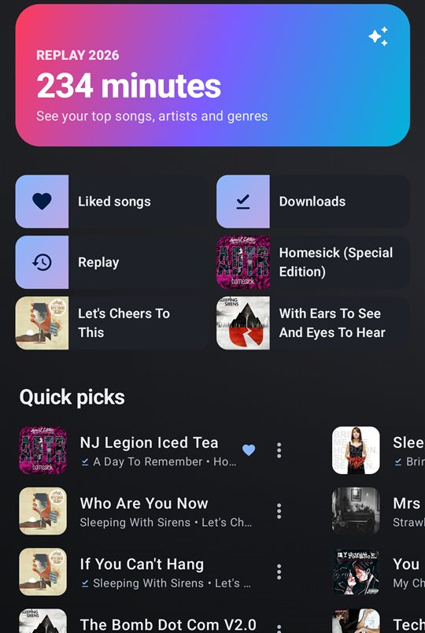<br>Home with Replay and shortcuts | 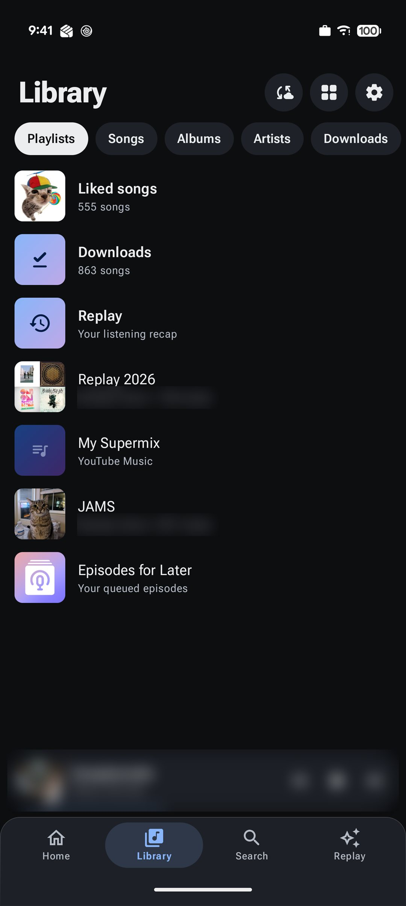<br>Library | 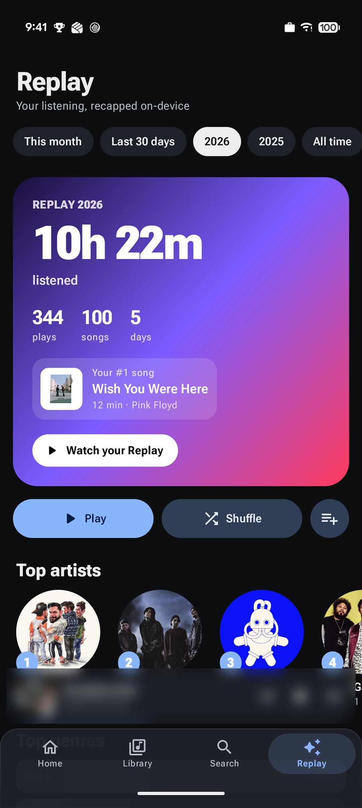<br>Replay, your on-device recap |
| 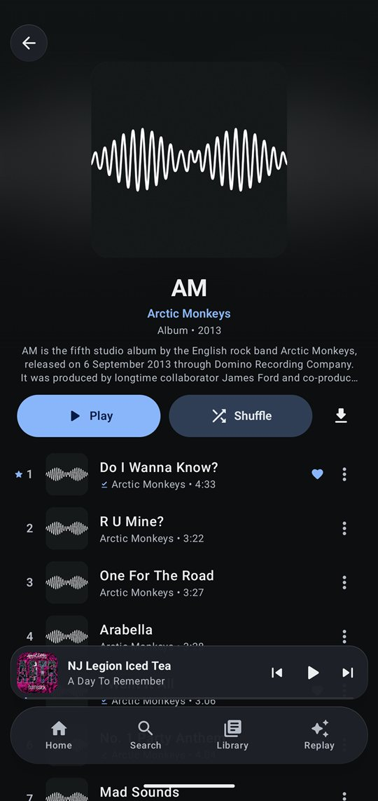<br>Albums with starred hits | 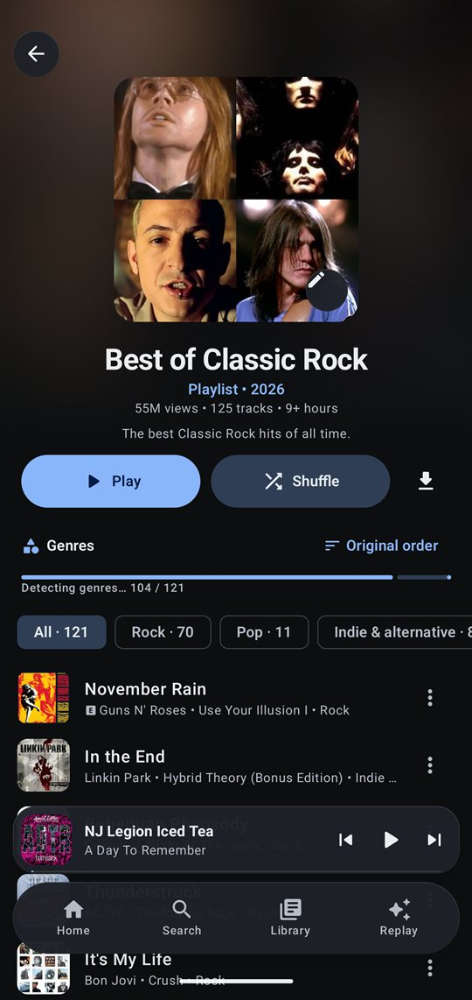<br>Playlists with your own picture and genre filters | 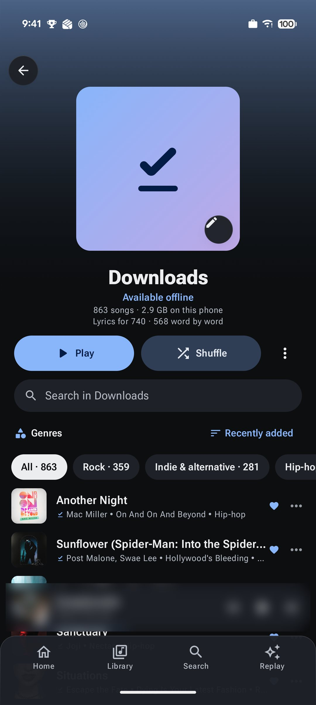<br>Downloads, with lyrics saved |
| 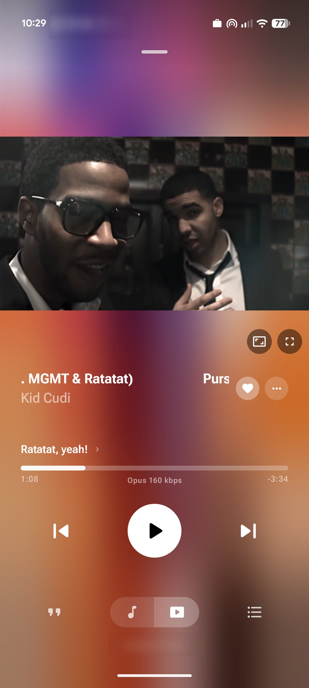<br>Music videos, one tap from the song | <br>Now playing | <br>Word-by-word lyrics |
| 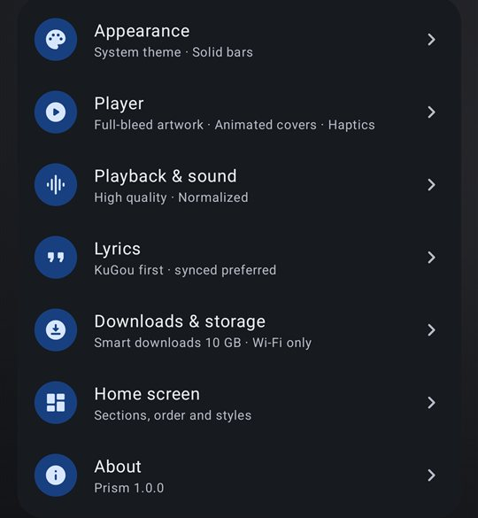<br>Settings | 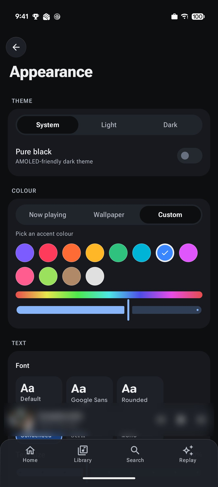<br>Theme, accent colour and fonts | 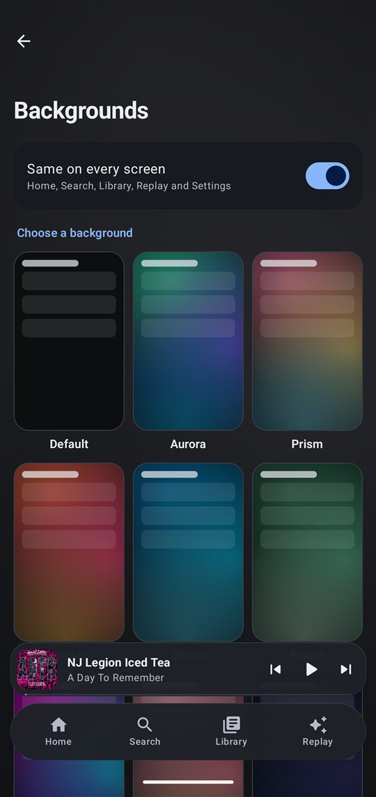<br>Screen backgrounds |
| 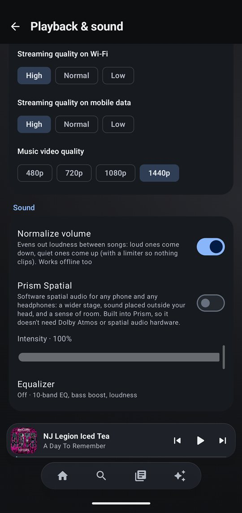<br>Lossless, normalization, video quality | 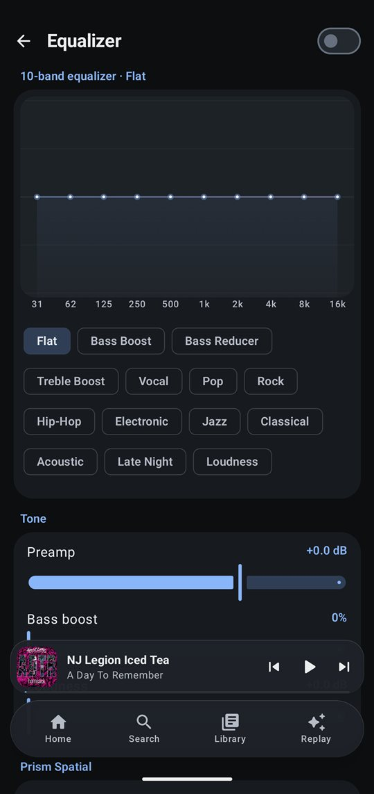<br>10-band equalizer | 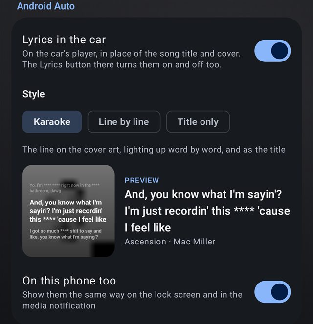<br>Android Auto lyrics, with preview |

<sub>Personal details and the mini player are blurred in these screenshots.</sub>

## Credits and inspiration

Prism doesn't ship artwork, fonts or code copied from other apps, but several ideas and data sources come from elsewhere:

- **Apple Music** inspired the artist page layout (including its 2026 frosted redesign, with the name and Info, Play and Favourite centred under the photo), starred most-played album tracks, headline artist typefaces and the animated cover style.
- **Spotify Jam** inspired Listen Together (built here to work without any server), and Spotify and Apple Music's share cards inspired the story cards.
- **Signatures** use fonts already on the phone, such as Android's own Dancing Script for the Autograph style.
- **BitChord** (itself modelled on Apple Music) inspired the Now Playing screen.
- **Spotify Wrapped** inspired the Replay story, including its "what's playing" card.
- **Lyrics:** [Better Lyrics](https://betterlyrics.org) (Apple Music TTML and QQ Music "Portato"), NetEase, KuGou, LyricsPlus, Bini, [LRCLIB](https://lrclib.net), Unison, Genius and YouTube Music. Lyrics belong to their rights holders.
- **Animated covers** come from Apple Music, Tidal and the ViVi Music canvas list.
- **Playlist import** hands off to [TuneMyMusic](https://www.tunemymusic.com), the transfer service YouTube Music's own app uses. It's a separate service; Prism shares nothing with it.
- **Signed-in streams:** [yt-dlp's EJS solver](https://github.com/yt-dlp/ejs) (Unlicense, bundling [meriyah](https://github.com/meriyah/meriyah) and [astring](https://github.com/davidbonnet/astring)) deciphers them, running on WebView's JavaScript engine through androidx.javascriptengine.
- **Libraries:** [NewPipe Extractor](https://github.com/TeamNewPipe/NewPipeExtractor), [Haze](https://github.com/chrisbanes/haze), [Coil](https://coil-kt.github.io/coil/), Media3 ExoPlayer and the rest of the stack below.
- Music and metadata are streamed from YouTube Music. All trademarks belong to their owners.

## Privacy

Prism talks to YouTube Music and the lyric services directly from your phone. There is no Prism server and no telemetry. Listening history, Replay stats, downloads and settings stay on the device; if you sign in, your session is stored only in the app's private storage. Listen Together only ever talks to the other phones in your session, on your local network, and only while it's open.

## Support Prism

Prism is free, has no ads and doesn't track you. It's built and maintained in my spare time. If you enjoy it and want to help keep it going, you can buy me a coffee on **[Ko-fi](https://ko-fi.com/yigder)**. Every tip helps, and is never expected.

<a href="https://ko-fi.com/yigder"></a>

## Building from source

Requirements: JDK 17+ and the Android SDK (compile SDK 37).

```bash
./gradlew :app:assembleRelease
```

The APK lands in `app/build/outputs/apk/release/`. Release builds are signed with the debug key so they install directly, and are deliberately unminified (NewPipe Extractor and Rhino rely on reflection). Use your own signing config before distributing your own builds.

Unit tests (some call live lyric and YouTube Music endpoints, so they need a network connection):

```bash
./gradlew :app:testDebugUnitTest
```

### Project layout

| Area | Where (`app/src/main/java/com/prism/music/`) |
|---|---|
| YouTube Music API, parsing and search ranking | `data/innertube/` |
| Stream resolving (NewPipe Extractor) | `data/stream/` |
| Lyric providers and TTML / LRC / QRC / YRC / KRC parsers | `data/lyrics/` |
| Playback service, audio effects, Android Auto and car lyrics | `playback/` |
| Listen Together (local-network sessions) | `playback/together/` |
| Downloads and smart downloads | `download/` |
| Compose UI and design kit | `ui/` |

Stack: Kotlin, Jetpack Compose (Material 3), Media3 ExoPlayer and MediaSession, Room, DataStore, OkHttp, kotlinx.serialization, Coil, WorkManager, NewPipe Extractor.
