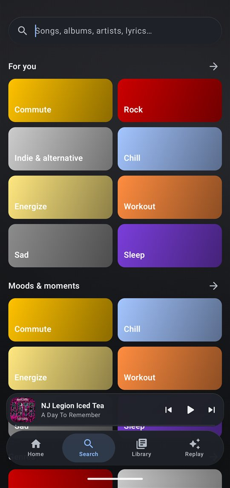
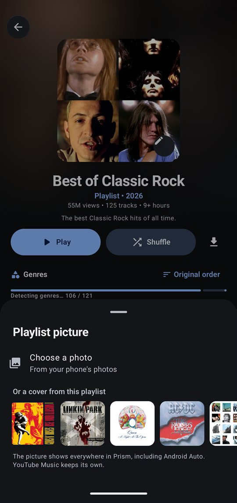

# Prism

A YouTube Music client for Android, written in Kotlin and Jetpack Compose. Word-by-word lyrics from ten sources, an Apple Music-style artist page, an on-device Replay recap, offline downloads, an equalizer and spatial audio, and a full Android Auto experience with lyrics on the car screen.

> Prism is an independent, unofficial app. It is not affiliated with, endorsed by, or connected to Google, YouTube or YouTube Music.

**[Download the latest APK](../../releases/latest)** · Android 8.0 or newer

<p>
  
  
  
  
</p>

## Features

### Listening
- **Lyrics, word by word.** Better Lyrics (Apple Music's timed lyrics), QQ Music "Portato", NetEase, KuGou, LyricsPlus, Bini, LRCLIB, Unison, Genius, YouTube Music and Lyrics.ovh. Prism goes for karaoke-style timing first, then line-synced, then plain. You can switch source per song and nudge the timing.
- **Player.** Full-bleed artwork, animated covers, and a one-tap switch between the song and its music video, with the lyrics kept in sync.
- **Sound.** 10-band equalizer with presets, bass boost, loudness normalization (uses YouTube's own loudness data, works offline), Prism Spatial (a software spatializer for any headphones), skip silence, and a lossless mode that can play matching FLAC files on the phone.
- **Autoplay and radio.** The queue keeps going with similar music once an album or playlist ends.

### Finding music
- **Search as you type.** Results show up while you type. A "Top results" view ranks songs, albums, artists, playlists and videos together, so "AM" finds the Arctic Monkeys album.
- **Artist pages** in the style of Apple Music: a full-bleed photo, a signature typeface for big artists, latest release, top songs, albums, singles, live albums and similar artists.
- **Albums** mark their most-played songs with a star.
- **Playlists** sort by title, artist, album, duration or genre, and can be filtered by genre.

### Your library
- **Downloads** for offline listening, with lyrics saved alongside every song. Includes smart downloads (keeps a chosen amount of your favourites on the phone), sorting by song, artist or album, and bulk delete.
- **Your own playlist pictures.** Pick a photo, or one of the playlist's own song covers.
- **Replay.** A private, on-device recap of your listening: minutes, top songs, top artists and genres, plus a full-screen story with music, made from what you play in Prism.
- **Backgrounds.** Eleven designs, the blurred cover of what's playing, or your own photo, for Home, Search, Library, Replay and Settings.
- Signing in with your YouTube Music account syncs likes, playlists, albums and artists both ways.

### Android Auto
- Browse Home, Liked songs, your library and recent plays, and search by voice.
- Every song list starts with **Shuffle play**.
- Extra buttons on the car's player: like, shuffle, repeat, lyrics on/off, start radio and "not for me".
- **Lyrics on the car screen.** The line being sung replaces the title, and the cover becomes a lyric card that lights up word by word. Line-by-line and title-only styles are there too.

## Screenshots

| | | |
|:-:|:-:|:-:|
| <br>Home | <br>Moods and genres | <br>Albums with starred hits |
| <br>Playlists with genre filters | <br>Custom playlist pictures | <br>Downloads, with lyrics saved |
| <br>Screen backgrounds | <br>Equalizer | <br>Quality, normalization, spatial audio |
| <br>Android Auto lyrics, with preview | <br>Settings | |

## Building

Requirements: JDK 17 or newer and the Android SDK (compile SDK 37). Android Studio works, or from the command line:

```bash
./gradlew :app:assembleRelease
```

The APK lands in `app/build/outputs/apk/release/`. Release builds are signed with the debug key so they install directly; use your own signing config before distributing builds of your own.

Unit tests (some call the live lyric and YouTube Music endpoints, so they need a network connection):

```bash
./gradlew :app:testDebugUnitTest
```

## How it's put together

| Area | Where |
|---|---|
| YouTube Music API, parsing and search ranking | `data/innertube/` |
| Stream resolving (with NewPipe Extractor) | `data/stream/` |
| Lyrics providers and the TTML / LRC / QRC / YRC / KRC parsers | `data/lyrics/` |
| Playback service, audio effects, Android Auto browse tree and car lyrics | `playback/` |
| Downloads and smart downloads | `download/` |
| Compose UI | `ui/` |

Stack: Kotlin, Jetpack Compose (Material 3), Media3 ExoPlayer and MediaSession, Room, DataStore, OkHttp, kotlinx.serialization, Coil, WorkManager.

## Privacy

Prism talks to YouTube Music and the lyric services directly from your phone; there is no Prism server. Your listening history, Replay stats, downloads and settings stay on the device. If you sign in, your YouTube Music session is stored only in the app's private storage.
